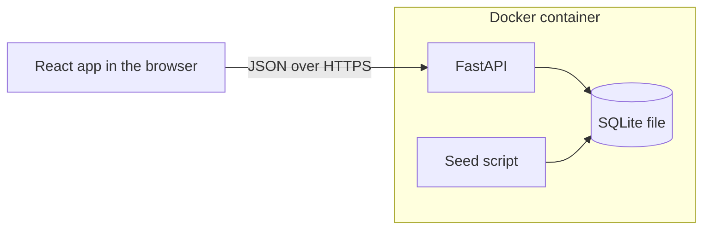

# Architecture

## Shape

One Docker container runs on my own server, deployed with Dokploy. FastAPI serves the API and the built React app, so there is one URL and no cross-origin setup. SQLite keeps the data in one file on a mounted volume. The HR password comes from an environment variable on the server and stays out of the repository.

## Stack

| Part | Choice |
| --- | --- |
| Backend | Python, FastAPI, SQLAlchemy, SQLite |
| UI | React, TypeScript, Vite, MUI |
| Tests | pytest for the backend, Vitest for the UI |
| Tooling | uv, npm, GitHub Actions for lint and tests |

## Data

- `employees`: employee number, name, email, country, department, job title, hire date, status, annual salary, currency.
- `salary_changes`: one row per change with the old amount, new amount, effective date and reason. The app adds rows and leaves old ones untouched.
- `exchange_rates`: a currency and its rate to USD. The rates are the ECB reference rates for 2026-10-05.

The database stores salaries as whole numbers in the smallest unit of the currency (cents, paise), so sums pick up no rounding errors.

One list in the code maps each country to its currency and USD rate. The seed script and the rate table both read it, and a test fails if they disagree.

## API

All calls sit under `/api`, so they do not clash with page addresses.

| Call | Purpose |
| --- | --- |
| `POST /login`, `POST /logout` | start and end the HR session |
| `GET /session` | tell the UI whether it is signed in |
| `GET /employees` | search, filter, sort, page |
| `POST /employees` | add a person |
| `GET /employees/{id}` | one person with their salary timeline |
| `PATCH /employees/{id}` | edit details, mark as left |
| `POST /employees/{id}/salary` | change a salary |
| `GET /insights` | figures for the company, or by country, department or job title |
| `GET /filters` | values for the filter dropdowns |
| `GET /health` | liveness check, open without login |

## Trade-offs

| Decision | Why | Limit |
| --- | --- | --- |
| SQLite over Postgres | One file, nothing to install, enough for one HR user | One server, one writer at a time |
| One container | One URL and one thing to deploy | API and UI scale together |
| Shared password with a signed cookie | Keeps the data private without building accounts | No record of who changed what |
| Fixed exchange rates | Same totals on each run | Totals drift from real rates |
| Median with window functions | SQLite's `median()` needs a build option that is off by default | More SQL to maintain |
| Insights in USD only | One currency makes groups comparable | Country figures do not appear in local currency |
| Country and hire date fixed after creation | A move changes currency and pay together | A relocation needs a new record |
| Tables created at startup, no migrations | The schema has one version so far | A schema change after release needs a migration tool |
| No limit on login attempts | A long random password makes guessing impractical | Needs a limit before real use |
| No browser end-to-end tests | Unit tests cover the logic and keep each run short | Layout bugs need a manual check |

## Performance at 10,000 employees

- The list loads 25 rows per request. The database does the search, filter and sort.
- Indexes cover country, department, job title and status.
- Insights run as grouped queries in the database. The app does not load all rows into memory.
- Name search scans the table, which is acceptable at this size. Millions of rows would need a full-text index.
- The seed script inserts all rows in one transaction. The app runs it on start when the database has no employees.

Measured on a laptop against the seeded data, inside the API process: a list page takes 1 to 6 ms and an insights view 12 to 14 ms.
